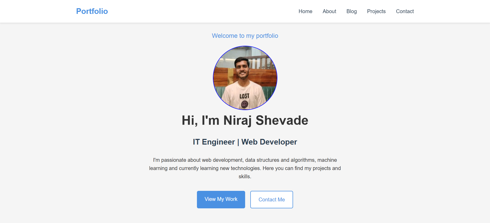
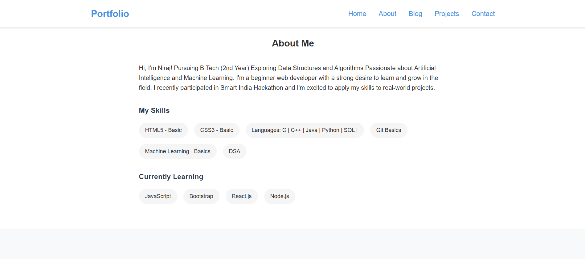

# 🌐 Niraj Shevade's Portfolio

Welcome to my personal developer portfolio! This website is a showcase of my background, skills, and ongoing journey in the world of web development, data structures, and emerging technologies like Machine Learning.


## 🚀 About Me

Hi, I'm **Niraj Shevade** — an enthusiastic **IT Engineering student (2nd Year)** with a passion for building modern web applications, solving algorithmic challenges, and exploring artificial intelligence. I love learning new technologies and applying them to real-world projects.

## 👨‍💻 Tech Stack

### 💡 Skills
- **Languages**: C, C++, Java, Python, SQL
- **Web**: HTML5 (Basic), CSS3 (Basic)
- **Foundations**: Data Structures & Algorithms (DSA), Git Basics
- **AI/ML**: Machine Learning (Basics)

### 📚 Currently Learning
- JavaScript
- React.js
- Node.js
- Bootstrap

## 📁 Sections of the Website

- **Home**: A brief welcome and introduction.
- **About**: My background, skills, and current learning goals.
- **Blog**: Articles, tutorials, or reflections (placeholder).
- **Projects**: Portfolio of personal and academic projects.
- **Contact**: Easy ways to connect with me.

## 📸 Preview




## 🛠️ Built With

- HTML5 & CSS3
- JavaScript (for interactivity)
- React.js (if applicable in future)
- Responsive Design Principles

## 📬 Contact Me

If you'd like to collaborate or just say hello, feel free to reach out!

- 📧 **Email**: nirajshevade5@gmail.com
- 🔗 **LinkedIn**: [https://www.linkedin.com/in/niraj-shevade-3113b8290/]
- 🌐 **Website**: [https://nirajshevade.netlify.app/]

---

## 📌 Setup Instructions (for developers)

To run this portfolio locally:

```bash
git clone https://github.com/yourusername/your-portfolio.git
cd your-portfolio
open index.html  # or open in VSCode/Live Server
